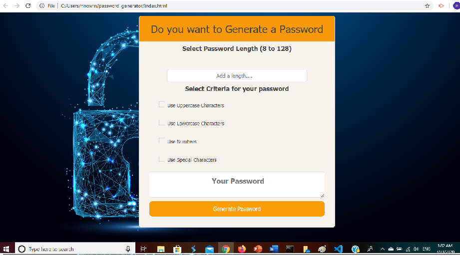

#  JavaScript: Password Generator
 Passwword generates is website that create random password based on user-selected criteria. This sites feature by dynamically updated HTML and CSS powered by JavaScript code.

## View THis Page [https://rumardas.github.io/portfolio/]

## Application Uses in this Projects
* Javascript
* Bootstrap
* Html
* CSS
## Criteria uses for password generation
* length  should be number
* length minium number is 8 
* length maxium  number is 128
* Must needs to input a length
* If criteria is not filled it shows  error messages
* For Other criterias usears can choose any option or multiple option or all of them by checkbox
* After user select right length and criteria option  the password shows in the message box
* Usears can change criteria any time

## Pages  view

## Font Decoration 

For font decoration uses I used google font 
link for that [https://fonts.googleapis.com/css?family=Bangers]

## Attribution
*[https://stackoverflow.com]
*[https://getbootstrap.com/docs/]
*[https://www.w3schools.com/bootstrap4/default.asp]

